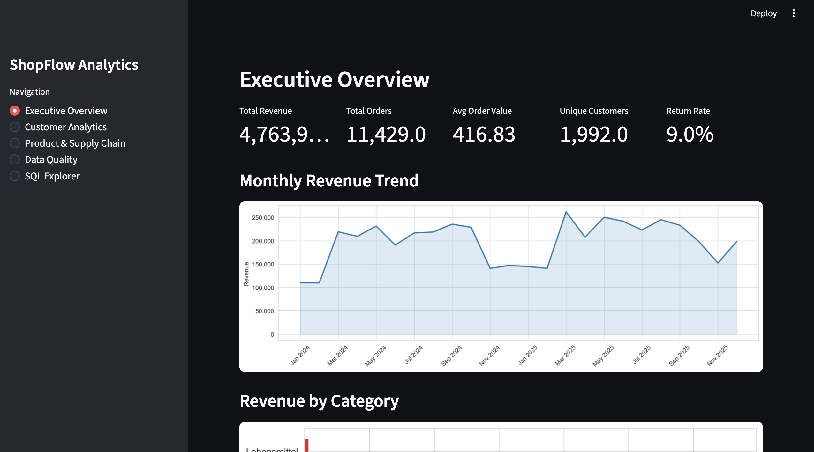
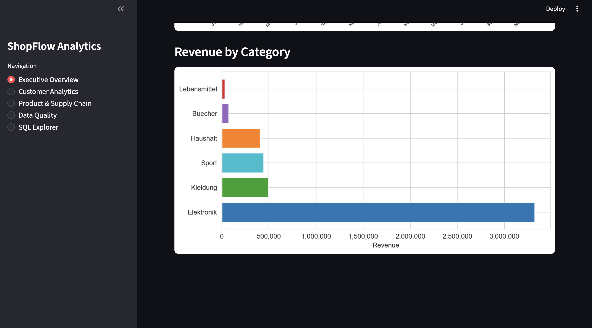
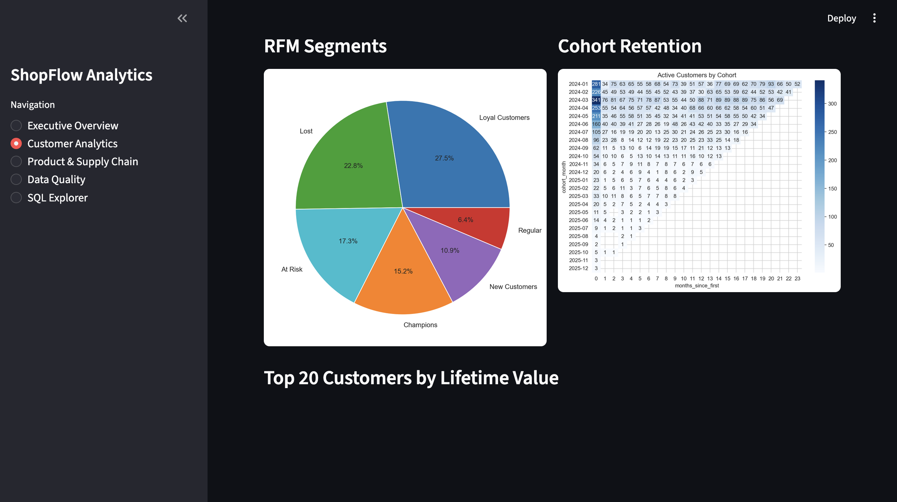
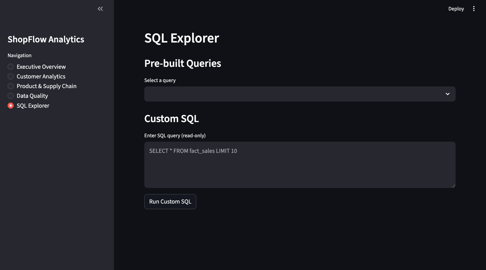

# ShopFlow ETL Pipeline

Multi-agent ETL pipeline that transforms raw e-commerce data into a star schema data warehouse with automated analytics and a Streamlit dashboard.


[](https://eugen-goebel-etl-pipeline-app-4shwqu.streamlit.app/)

> **Try it live:** [eugen-goebel-etl-pipeline-app-4shwqu.streamlit.app](https://eugen-goebel-etl-pipeline-app-4shwqu.streamlit.app/). Fully hosted, no setup. The demo database is auto-generated on first visit (~30s); after that you can explore the dashboard, KPIs, and SQL Explorer interactively.

## Screenshots

**Executive Overview**: KPI cards and monthly revenue trend


**Revenue by Category**: cross-category performance breakdown


**Customer Analytics**: RFM segmentation and cohort retention heatmap


**SQL Explorer**: run pre-built or custom SQL queries against the warehouse


## Architecture

```
Raw Data (CSV/JSON)
        |
   [1] EXTRACT ──── CSVExtractor / JSONExtractor / APIExtractor
        |
   [2] VALIDATE ─── DataValidator (null checks, business rules, referential integrity)
        |
   [3] TRANSFORM ── DataCleaner + DataEnricher (dedup, standardize, derived columns)
        |
   [4] BUILD ────── DimensionBuilder + FactBuilder (star schema)
        |
   [5] LOAD ─────── DatabaseLoader (SQLite, idempotent full-refresh)
        |
   [6] ANALYZE ──── AnalyticsEngine (15 pre-built SQL queries + KPIs)
```

## Star Schema

```
┌──────────────┐     ┌──────────────┐     ┌──────────────┐
│   dim_date   │     │ dim_customer │     │ dim_supplier  │
├──────────────┤     ├──────────────┤     ├──────────────┤
│ date_key (PK)│     │customer_key  │     │supplier_key  │
│ full_date    │     │customer_id   │     │supplier_id   │
│ year/quarter │     │name/email    │     │name/country  │
│ month/week   │     │region/city   │     │lead_time_days│
│ day_of_week  │     │segment       │     │reliability   │
│ is_weekend   │     │signup_date   │     └──────┬───────┘
│ fiscal_qtr   │     └──────┬───────┘            │
└──────┬───────┘            │           ┌────────┴───────┐
       │              ┌─────┴─────┐     │  dim_product   │
       │              │           │     ├────────────────┤
       └──────────────┤fact_sales ├─────┤product_key     │
                      ├───────────┤     │product_id/name │
                      │order_key  │     │category/brand  │
                      │date_key   │     │supplier_key(FK)│
                      │customer_  │     │cost/retail     │
                      │  key      │     │margin_pct      │
                      │product_key│     └────────────────┘
                      │quantity   │
                      │total_amt  │
                      │profit_mrg │
                      │is_returned│
                      └───────────┘
```

## Features

- **6-source extraction**: CSV, JSON, mock API (shipping events)
- **Data quality validation**: null checks, business rules, referential integrity, quarantine
- **Star schema dimensional modeling**: 4 dimensions + 1 fact table + daily aggregates
- **15 pre-built SQL analytics queries** using window functions, CTEs, NTILE, DENSE_RANK
- **Streamlit dashboard** with 5 pages: Executive Overview, Customer Analytics, Product & Supply Chain, Data Quality, SQL Explorer
- **60+ automated tests** with pytest
- **German locale sample data** via Faker (2K customers, 12K orders, 300 products)

## Tech Stack


## Quick Start

```bash
# Clone
git clone https://github.com/eugen-goebel/etl-pipeline.git
cd etl-pipeline

# Install dependencies
pip install -r requirements.txt

# Generate sample data (12K orders, 2K customers, 300 products)
python main.py --generate

# Or: generate data and run full pipeline in one step
python main.py --generate

# Launch the dashboard
streamlit run app.py
```

## CLI Usage

```bash
# Run pipeline with defaults
python main.py

# Generate sample data first, then run pipeline
python main.py --generate

# List available SQL queries
python main.py --list-queries

# Run a specific query after pipeline
python main.py --query rfm_segmentation

# Custom paths
python main.py --data-dir data --db-path output/shopflow.db
```

## SQL Highlights

### Revenue Trends with Window Functions

```sql
WITH monthly AS (
    SELECT d.year, d.month, d.month_name,
           ROUND(SUM(f.total_amount), 2) AS revenue,
           COUNT(DISTINCT f.order_key) AS orders
    FROM fact_sales f
    JOIN dim_date d ON f.date_key = d.date_key
    GROUP BY d.year, d.month, d.month_name
)
SELECT year, month, month_name, revenue, orders,
       ROUND(SUM(revenue) OVER (ORDER BY year, month), 2) AS cumulative_revenue,
       ROUND((revenue - LAG(revenue) OVER (ORDER BY year, month)) * 100.0
           / NULLIF(LAG(revenue) OVER (ORDER BY year, month), 0), 1) AS mom_growth_pct
FROM monthly
ORDER BY year, month;
```

### RFM Segmentation with NTILE

```sql
WITH rfm_raw AS (
    SELECT f.customer_key, c.customer_id,
           julianday('2026-01-01') - julianday(MAX(d.full_date)) AS recency_days,
           COUNT(DISTINCT f.order_key) AS frequency,
           ROUND(SUM(f.total_amount), 2) AS monetary
    FROM fact_sales f
    JOIN dim_customer c ON f.customer_key = c.customer_key
    JOIN dim_date d ON f.date_key = d.date_key
    GROUP BY f.customer_key, c.customer_id
),
rfm_scored AS (
    SELECT *,
           NTILE(5) OVER (ORDER BY recency_days DESC) AS r_score,
           NTILE(5) OVER (ORDER BY frequency ASC) AS f_score,
           NTILE(5) OVER (ORDER BY monetary ASC) AS m_score
    FROM rfm_raw
)
SELECT customer_id, r_score, f_score, m_score,
       CASE
           WHEN r_score >= 4 AND f_score >= 4 AND m_score >= 4 THEN 'Champions'
           WHEN r_score >= 3 AND f_score >= 3 THEN 'Loyal Customers'
           WHEN r_score <= 2 AND f_score >= 3 THEN 'At Risk'
           ELSE 'Regular'
       END AS segment
FROM rfm_scored ORDER BY monetary DESC;
```

## Project Structure

```
etl-pipeline/
├── agents/
│   ├── extractors.py          # CSV/JSON/API data extraction
│   ├── validators.py          # Data quality validation
│   ├── transformers.py        # Cleaning and enrichment
│   ├── dimension_builder.py   # Star schema dimension/fact builders
│   ├── loader.py              # SQLite database loader
│   ├── analytics_engine.py    # SQL query execution engine
│   └── orchestrator.py        # 6-phase pipeline coordinator
├── models/
│   ├── sources.py             # Raw data Pydantic models
│   ├── dimensions.py          # Star schema Pydantic models
│   ├── quality.py             # Data quality models
│   └── analytics.py           # Analytics result models
├── db/
│   ├── database.py            # SQLAlchemy engine and helpers
│   └── orm_models.py          # ORM table definitions
├── sql/
│   ├── schema/                # DDL scripts
│   └── queries/               # 15 analytics queries
├── data/
│   ├── generate_sample_data.py
│   └── raw/                   # Generated sample data
├── tests/                     # 60+ pytest tests
├── app.py                     # Streamlit dashboard (5 pages)
├── main.py                    # CLI entry point
├── requirements.txt
└── LICENSE
```

## Running Tests

```bash
pytest -v
```

## License

MIT
